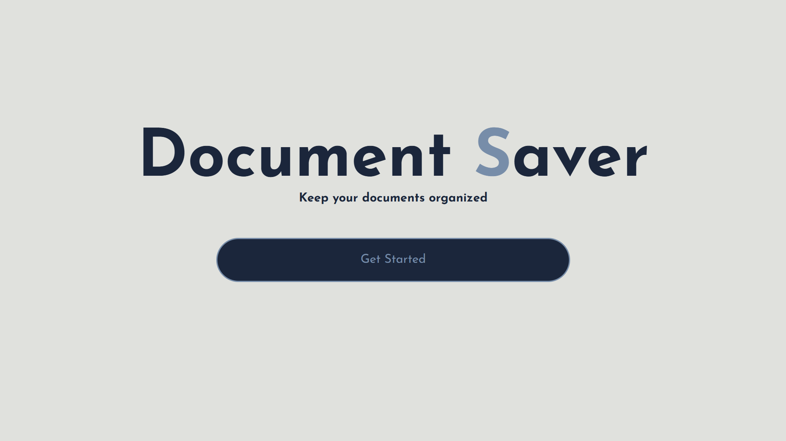
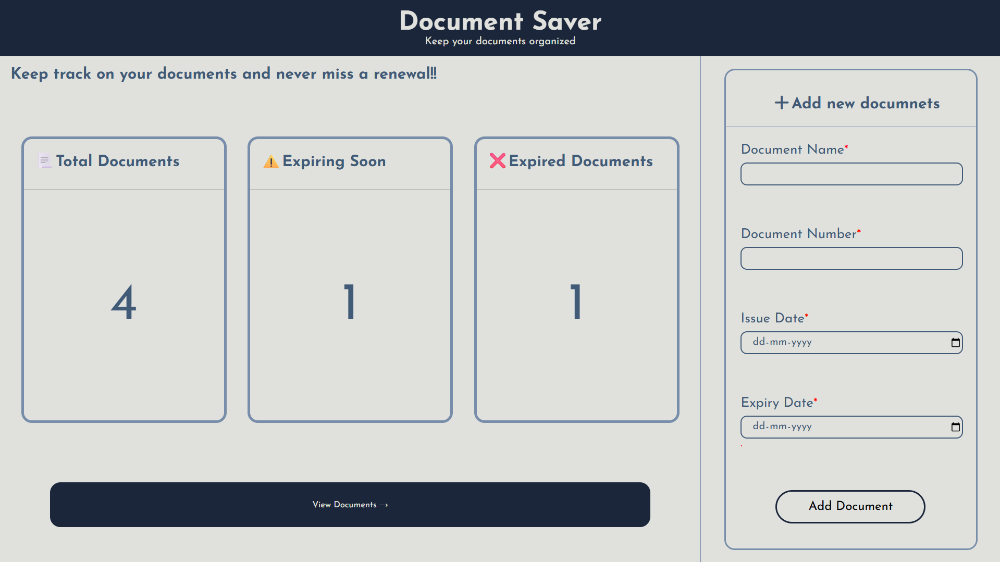
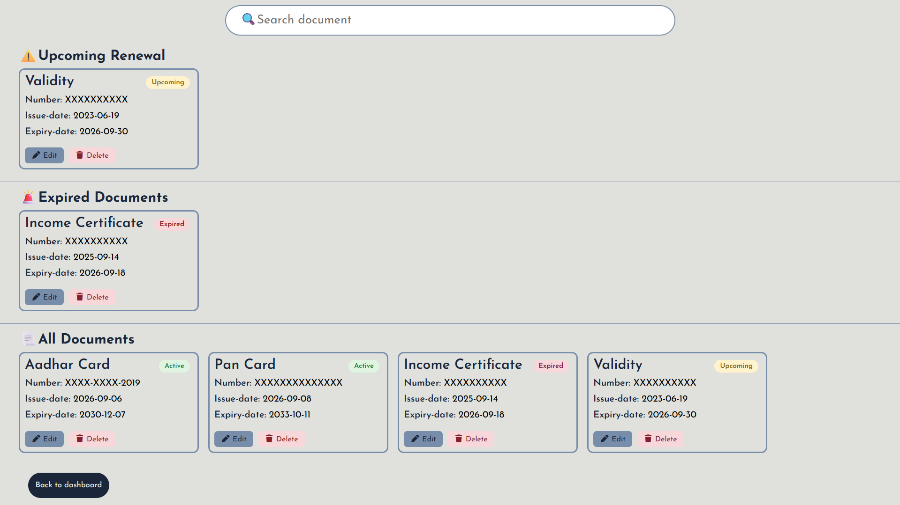

## 📁 Document Saver

A simple and user-friendly web application for managing important documents digitally. The project allows users to add document details, organize them in one place, search for documents quickly, and keep track of expiry and renewal dates.

## 📸 Screenshots

## 🚀 Features

-📄 Add important document details
-🗂️ Organize documents digitally
-🔍 Search for documents quickly
-📅 Track document expiry dates
-🔄 Keep track of renewal dates
-✏️ Edit document information
-🗑️ Delete documents when no longer required

## 🎯 Problem Statement

Managing important documents manually can be difficult and time-consuming.

-Important documents can be difficult to organize.
-People may forget document expiry dates.
-Renewal dates can be missed.
-Finding a particular document can take time.

## 💡 Solution

The Document Saver provides a centralized digital platform where users can store and manage important document information.

Users can add details such as the document name, document number, issue date, and expiry date. The application makes it easier to search, organize, and keep track of important dates.

## 🛠️ Technologies Used
-HTML
-CSS
-JavaScript
-Github

## 🔮 Future Scope

-🔐 User Authentication – Add secure login and registration for users.
-🔔 Expiry Reminders – Send automatic notifications before a document expires.
-🔄 Renewal Reminders – Notify users when a document needs to be renewed.
-📊 Dashboard – Display document statistics, upcoming expiries, and recently added documents.
-📱 Mobile Application – Develop a mobile version for easier access.
-🔒 Data Security – Add encryption and additional security measures to protect sensitive document information.
-📎 Document Upload – Allow users to upload and store actual document files.
-🔍 Advanced Search & Filtering – Search documents by name, category, expiry date, or document number.

## 🌐 Live Demo

[View Live Project](https://unnati-chaudhari.github.io/Document-Saver/)

## 📌 GitHub Repository

[View Source Code](https://github.com/Unnati-Chaudhari/Document-Saver)

## 👩‍💻 Author

Unnati Chaudhari
🔗 [GitHub Profile](https://github.com/Unnati-Chaudhari)

## Thank You

